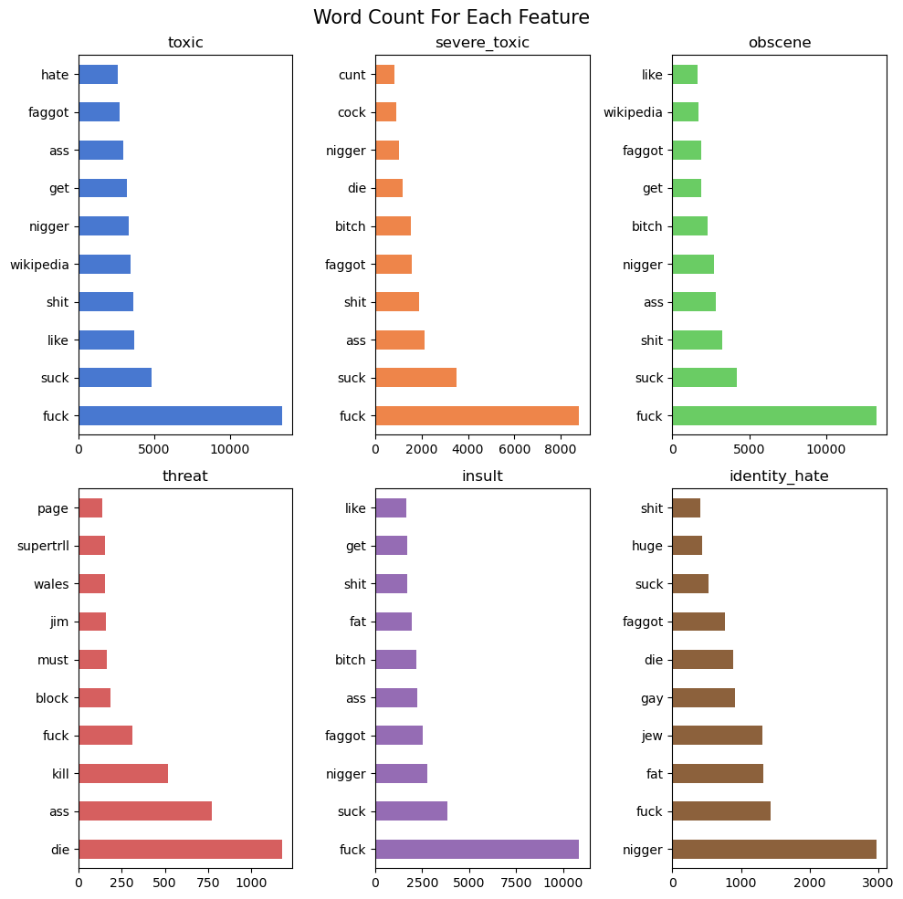
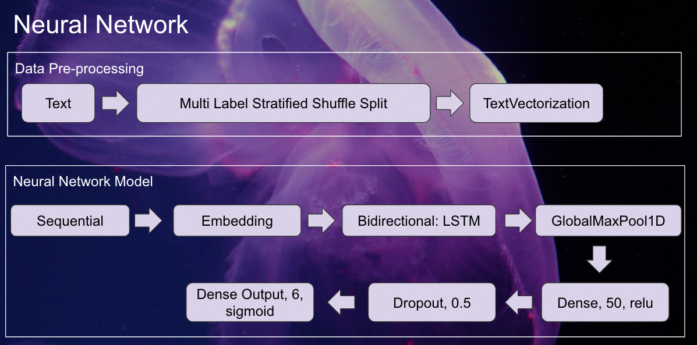
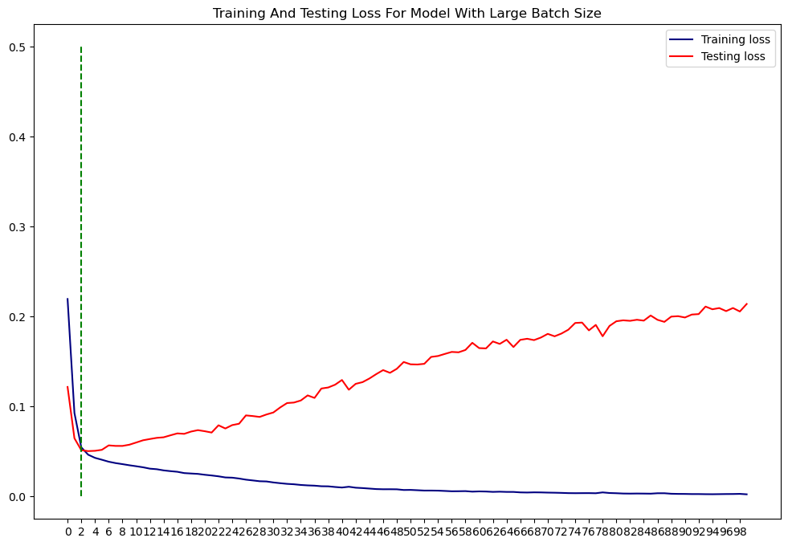

# Toxic Comments Classification

---

# Introduction

 
There are a lot of social media websites in the world, from Meta(Facebook) to the latest social media craze, Tiktok, and they are expanding non stop. This stems from us humans wanting to find interaction online with other people, to post media posts that are well liked by public, and for some, it is a gateway to becoming a celebrity. Social media is way for us to find like minded people and to share our experiences with one another. It is an open world with freedom of speech. 
With this freedom, comes with disadvantages, people can leave bad comments, especially toxic comments, when they are displeased with what they see. 
There are several reasons for these and with reference to this [website](https://www.verywellmind.com/mental-health-effects-of-reading-negative-comments-online-5090287)
1. Anonymity - this means that nobody feels accountable for what they say.
2. Dehumanization - As we are typing through the computer, we are unable to see the person we are talking to on the other end.
3. Mob Mentality - When one person says something negative, this opens the floodgates for others to do the same

With some of the reasons stated above, this may lead to toxic comments shown in social media. These toxic comments may lead to depression and negativity, or even suicide.
Hence, for some people, the easiest way to not see these comments, are to stop using that particular platform. This in turn would affect the particular social media platform, as every user equals to a business.

From this article in 2014, it is mentioned that one-in-five internet users have been victims of online harassment, with social media sites being the most common place.
As this was from 2014, especially with the Covid-19 outbreak, which increased the usage of the internet, we can assume that these numbers are much higher now.

Hence, finding a way to filter out the toxic comments, would help not the users and the interactions, but also the social media platform.

---

# Data Overview

This is a project to classify toxic comments using machine learning algorithms. The dataset is taken from kaggle. The dataset can be found [here](https://www.kaggle.com/c/jigsaw-toxic-comment-classification-challenge/data). 
Even though that the data provided contains a train and test set. To further solidify my data science concepts, I have decided to only use the train set only. I have also split the code into 2 separate notebooks:
1. EDA.ipynb - Data Analysis and Data Pre-processing
2. modeling.ipynb - Model creation for Machine Learning

The dataset contains 159571 comments and 6 labels. The labels are toxic, severe_toxic, obscene, threat, insult, identity_hate. Each row can contain more than 1 label, making this a multi-label problem.

For easier identification through the project, The comments with the labels of either toxic, severe_toxic, obscene, threat, insult and identity_hate, will be named as negative, with the other comments are named positive. If there are any mention of a specific feature, the feature named will be used.

The dataset was found to be imbalanced. Here is the breakdown:

 | No. of Labels | No. of Rows |
 |:-:|:-:|
 | 0 | 145,346 |
 | 1 | 6,360 |
 | 2 | 3,480 |
 | 3 | 4,209 |
 | 4 | 1,760|
 | 5 | 385|
 | 6 | 31 |

 In total, there are about 90% positive comments, and 10% negative comments.

## Data Cleaning

The data was further cleaned by the following methods:

1. Remove punctuation
2. Remove numbers
3. Remove special characters - for example: emojis
4. Remove HTML tags
5. Removal URL

Countvectorizer was used to showcase the most common words in each feature.

Logically, the word "fuck" was most commonly seen in all of the features. This is no surprise, as that word is considered one of the most offensive words in the English language.

---
# Machine Learning

Due to the dataset being a multi-label problem, there will be two different types of modeling done.
1. Split modeling - the labels will be splited, with each model created for each label.
2. Combine Modeling - the model will be created for the entire dataset.

## Split Modeling
The following models were used for the split modeling:
1. Logistic Regression
2. LinearSVC
3. Naive Bayes

A gridsearchcv was used to hyper-parameter tune the models, and the metrics used was the average precision. Due to the data imbalance, the average precision was used instead of accuracy. This is because the accuracy score will be skewed towards the majority class, which is the positive class.

The best model was selected based on the average precision score, with the threshold on the best f1-score.
## Neural Network
Due to the multi-label dataset, the sklearn's train test split is unable to be used. An alternative was done via Multi Label Stratified Shuffle Split.

The following flow was used:

* The data was split into train and test set by multi label stratified shuffle split
* A textvectorization from Keras was used to vectorize the text data
* The vectorized data was then fed into a neural network with the following layers:
    * Embedding layer
    * Bidirectional LSTM layer
    * Global Max Pooling 1D layer
    * Dense layer
    * Dropout layer
    * Dense layer

The model was trained for 100 epochs, with a batch size of 1024. This large batch size was to account for the imbalanced data. The model was trained on a GPU, and the training time was about 1 hour.

The best model was found to be at 3 epoch, where the loss of the train and test set converges.

Where the green line showed the model that was selected at 3 epochs.

Best models were deployed by the usage of Gradio.

# Conclusion and Recommendations

1. The 2 different methods of modeling clearly showed that binary classification is better than multi-label classification. This is because the multi-label classification was not able to achieve a high f1-score, and the binary classification was able to achieve a high f1-score.
2. However, having said that, the split modeling took up a lot of time, as there were 6 models to be created. The combine method with nerual network, together with a GPU, took a much shorter time of about 1 hour to train the model. 
3. Even though the neural network Precision-Recall curve was not as good as the split modeling, we can see that the neural network is doing quite low of a overall f1-score of 0.73 (micro average). This shows that this model can be further improved by using transfer learning, like Word2Vec or Bert models, and also by using a larger dataset.
4. In addition, neural network has the bi-directional LSTM layer, which is able to capture the context of the words. This is not possible with the split modeling, as the models are not able to capture the context of the words.
